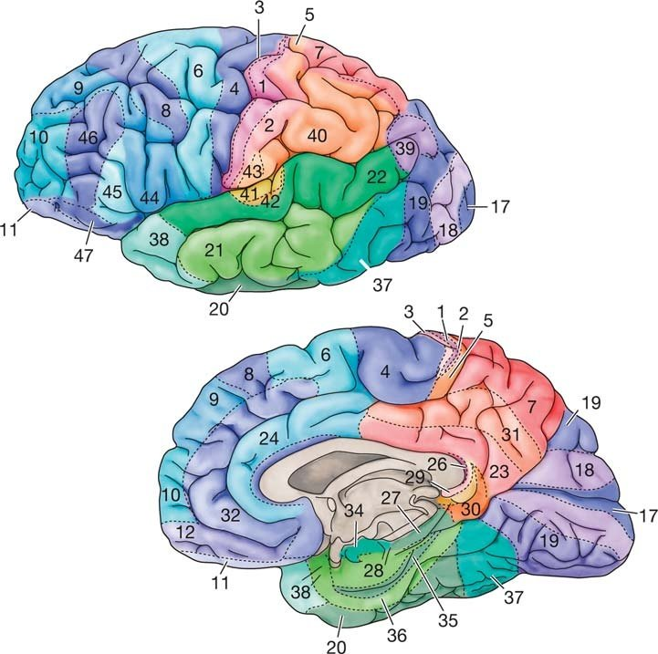

### Exercise: Connect your brain

1. Take a look at basic tools to deal with graphs in R such as the igraph and ggraph packages.
2. Load the pre???processed data matrix $X$ contained in the file hw2_data.RData. The resulting object named $t$, $mts$ is a (240 ?? 81) numerical matrix. The 81 columns are related to different Brodmann cortical areas labeled with an integer plus a prefix $L$ or $R$ depending on the hemisphere they belong. The rows instead are the observation times (again, here we will drop the temporal dependency). Notice that, for each cortical area, the time series we are working on is obtained by averaging those associated to voxels belonging to the same Brodmann area.
3. With this data, consider any association measure you want (but partial correlation, see the last point), and implement the bootstrap procedure described in the box above entitled "simultaneous bootstrapped CI???s for a generic association measure $\rho$".
4. Graphically represent the estimated graph but try to:
  - visualize its dynamic as $\epsilon$ varies
  - visualize the strengh of the dependency adopting a suitable color-scale for the edges of the graph. Draw some conclusion: what are the areas that show the highest/lowest degree of connectivity?
5. Repeat the analysis using this time the linear partial correlation coefficient as implemented in package SIN. Compare the results... even better if ???visually???...

### Solution
*Disclaimer:* bear in mind that graphs could not be represented properly (various overlaps) in a .html/.pdf for a matter of dimensions, probably. Please, use the Markdown. 

```{r}
# Loading data
load("./hw2_data.RData")

# N observations, D features
N <- nrow(mts)
D <- ncol(mts)

# for reproducibility
set.seed(1527999)

# Brodmann mapping: https://brmlab.cz/project/brain_hacking/broadmannarea
colnames(mts)
```
```{r, out.width = "200px", fig.align = 'center'}

```

There's not any particular need to go for a complete dataset analysis since it has been cleaned and pre-processed, as stated in the text. However, we could proceed with a simple $hist()$ in order to have an overall view of the data (es. its distribution, skewness, ...).

```{r}
hist(mts, prob = T, col = "pink", border = "white", main = "Histogram + Kernel Density Estimator", xlab = "Data", breaks = 25)
lines(density(mts, na.rm = T), co = "purple", lwd = 4)
rug(mts)
box()
```

As requested in the text, we need to evaluate and represent brain's functional connectivity applying our dataset to an association graph. This could be achieved working on correlations between features (or Broadmann areas). Firstly, we will apply Pearson's coefficient which is a way to obtain information about linear dependancy between two variables. In our case we will compute it throght $cor()$ function to get coefficients in the range $[-1, 1]$ within a $DxD$ matrix where D is the no. of features (Broadmann areas). The closer the coefficient is to zero, the weaker a correlation is.

Let plot it to see what is it about.

```{r}
# We'll consider Pearson's correlation in order to infer how much some brain areas interact between them
# Evaluate the correlation between vars producing a DxD matrix
mts_cor <- cor(mts)

# take a "snapshot" of it
require(corrplot)
corrplot(mts_cor, diag = FALSE, order = "FPC", tl.pos = "td", tl.cex = 0.4,
         method = "color", type = "upper")
```

Then, we implement the simultaneous bootstrapped Confidence Intervals for our chosen correlation measure. We may want to deal with non-parametric bootstrapping in order to compute those confidence intervals mentioned above. Particularly, the bootstrap method is the perfect approach to deal with a small dataset through resampling and it allows us to compute complex additional statistics, like in our case $\Delta_b$ (as suggested in the text). Specifically, those CIs will be used to filter out some edges whenever $\epsilon$ changes and correlations values will be the weights of the connections between features.

```{r}
B <- 1000 # no. of bootstrap iterations 

#renaming to match naming convention
X <- mts
Rhat <- mts_cor

# implement a custom bootstrap function 
bootstrap_for_pearson <- function (b_times = 500, n_observ = NA,
                                   d_features = NA, true_mat = NA, corr_mat = NA) {
  delta_b <- c() 
  Xstar <- matrix(NA, nrow = n_observ, ncol = d_features)

  # run bootstrap
  for (b in 1:b_times) {
    idx <- sample(1:n_observ, replace = TRUE)
    
    # generating sample taken from index "idx"
    for (i in 1:length(true_mat[,1])) {
      Xstar[i,] <- true_mat[idx[i],]
    }
    
    # Correlations from bootstrapped sample
    Rstar_b <- cor(Xstar)
    
    # Additional statistics 
    delta_b[b] <- sqrt(n_observ) * max(abs(Rstar_b - corr_mat))
  }
  
  return(delta_b)
}

# get the additional statistics requested in the text 
delta_b <- bootstrap_for_pearson(b_times = B, n_observ = N, d_features = D,
                                 true_mat = X, corr_mat = Rhat)
# show its ecdf 
plot(ecdf(delta_b))
```

We can now proceed to calculate our CIs using quantile method, as requested in the text.

```{r}
suppressWarnings(suppressMessages(library(GoFKernel)))

# simultaneous Confidence Intervals
alpha <- 0.05 # 95%
quantile_ecdf <- quantile(ecdf(delta_b))
ecdf_inv <- inverse(ecdf(delta_b), lower = quantile_ecdf[1],
                    upper = quantile_ecdf[5]) # from 0% to 100%

# Bonferroni correction need to tackle multiplicity issue
# Without adjusting for multiplicity we cannot talk about the overall
# topology of the brain network (cit.)
# This should avoid having duplicte edges
m = prod(1:D)/(prod(1:2) * prod(1:(D - 2))) # binomial coefficient
t_alpha_bonf <- ecdf_inv(1 - (alpha / m))

# compute lower/upper bounds
lower_ci_bonf <- Rhat - (t_alpha_bonf/sqrt(N))
upper_ci_bonf <- Rhat + (t_alpha_bonf/sqrt(N))

# show lower/upper bounds of CI
round(lower_ci_bonf[1:10, 1:10], 3)
round(upper_ci_bonf[1:10, 1:10], 3)
```

At this point, we would like to check whether each Pearson coefficient from $mts\_cor$ matrix is bound between its related simultaneous CIs: 

```{r}
# property test
# every correlation should be bound within the CI
check_bonf = matrix(NA, nrow = nrow(mts_cor), ncol = ncol(mts_cor))
for (i in 1:ncol(mts_cor)) {
  for (j in 1:nrow(mts_cor)) {
    check_bonf[i, j] <- mts_cor[i, j] < upper_ci_bonf[i, j] && mts_cor[i, j] >= lower_ci_bonf[i, j]
  }
}

# every value in the matrix "check_bonf" has to be TRUE; otherwise, we'll have FALSE
all(check_bonf)
```

The next step consists in building an association graph. So, we need to create an adjacency matrix where we would put an edge whether $[-\epsilon, \epsilon] \cap  C_n,\alpha = \emptyset$, as explained in the text. Then, we will compute two different adjacency matrices for two different $\epsilon$ to compare the resulting graphs' architectures.

```{r}
suppressWarnings(suppressMessages(library(igraph)))

# create the adjacency matrix
# filtering out unwanted edges which doesn't meet the condition in the if clause
apply_eps_on_adjm <- function (epsilon = .9, upper_mat = NA,
                               lower_mat = NA, true_mat = NA) {
  # create the adjacency matrix from an empty one
  adj_matrix <- matrix(0, nrow = D, ncol = D)

  # iterate over the adj matrix
  for (j in 1:ncol(upper_ci_bonf)) {
    for (k in 1:nrow(upper_ci_bonf)) {
      
      # Skip diagonal
      if (j == k) { next }
      
      # MAIN: if confidence intervals intersect with [-eps, +eps], discard the edge
      if (upper_ci_bonf[j, k] < epsilon && upper_ci_bonf[j, k] > -epsilon) { next }
      if (lower_ci_bonf[j, k] < epsilon && lower_ci_bonf[j, k] > -epsilon) { next }
      
      # otherwise, put the Rhat value (Pearson correlation coefficient)
      adj_matrix[j, k] <- abs(Rhat[j, k]) # so we could use bellmann ford for connected components
    }
  }
  return(adj_matrix)
}

# different epsilon to experiment with
epsilon_1 <- 0.35
epsilon_2 <- 0.50

# build adjancecy matrix working on upper/lower siultaneous CIs and filtering edges out through epsilon  
adj_matrix_1 <- apply_eps_on_adjm(epsilon = epsilon_1, upper_mat = upper_ci_bonf,
                                lower_mat = lower_ci_bonf, true_mat = Rhat)
adj_matrix_2 <- apply_eps_on_adjm(epsilon = epsilon_2, upper_mat = upper_ci_bonf,
                                lower_mat = lower_ci_bonf, true_mat = Rhat)

# settings adjacency matrix up with row/colnames fromt the dataset
colnames(adj_matrix_1) <- colnames(mts)
rownames(adj_matrix_1) <- colnames(mts)
colnames(adj_matrix_2) <- colnames(mts)
rownames(adj_matrix_2) <- colnames(mts)

# print insights about available edges on the created adjacency matrix using a certain epsilon
paste("epsilon", epsilon_1, "->", length(adj_matrix_1[adj_matrix_1 > 0.0]), "over",
      length(adj_matrix_1), "possible edges")
paste("epsilon", epsilon_2, "->", length(adj_matrix_2[adj_matrix_2 > 0.0]), "over",
      length(adj_matrix_2), "possible edges")
```

The function below is a utility created ad-hoc to facilitate the process of plotting an adjacency matrix as a graph with different features, such as:

* different layouts
* colors on vertices and edges to represent strength
* weighted graphs
* vertices size based on their degrees

This would help us gathering much more insights. Code is fairly commented.

```{r}
# Building an association graph taking an adjacency matrix as input
build_graph = function (adj_mat, mode_ = "undirected", color_.edge = FALSE,
                        color_.edge.intra = FALSE, weighted_ = NULL, layout_ = "on_sphere",
                        size_on_degree = 0, main_ = NULL) {
  palette.black = "#000000"
  palette.grey = "#444444"
  palette.green = "#00FF00"
  palette.red = "#FF0000"
  palette.purple = "#FF00FF"
  palette.yellow = "FFFF00"
  
  # compute graph
  M_graph <- graph.adjacency(adj_mat, mode = mode_, weighted = weighted_)
  
  # default colours
  E(M_graph)$color <- palette.grey
  V(M_graph)$color <- c(rep(palette.green, 39), rep(palette.red, 42)) # R/L -> green/red 
  
  # layout 
  layout <- layout_on_sphere(M_graph) # default
  
  if (identical(layout_, "on_sphere")) {
    layout <- layout_on_sphere(M_graph)
  } else if (identical(layout_, "on_grid")) {
    layout <- layout_on_grid(M_graph)
  } else if (identical(layout_, "components")) {
    layout <- layout_components(M_graph)
  }
  
  # coloured version of the graph will reveal more insights 
  if (isTRUE(color_.edge)) {
    # in case the graph is weighted we could represent edges strength using 4 colours
    if (isTRUE(weighted_) && !isTRUE(color_.edge.intra)) {
      min_ <- min(E(M_graph)$weight) # min edge weight
      max_ <- max(E(M_graph)$weight) # max edge weight
      interval_ <- (max_ - min_) / 4 # 4 different intervals
      shade_1 <- min_ + interval_
      shade_2 <- shade_1 + interval_
      shade_3 <- shade_2 + interval_
      shade_4 <- max_
      E(M_graph)[abs(weight) <= shade_4]$color <- "#ffedbf" # darker -> weaker
      E(M_graph)[abs(weight) <= shade_3]$color <- "#ffcd74" 
      E(M_graph)[abs(weight) <= shade_2]$color <- "#ff7251"
      E(M_graph)[abs(weight) <= shade_1]$color <- "#9b2948" # lighter -> stronger
    }
    
    # Yellow edges for the ones that communicate left-to-right and viceversa
    if (isTRUE(color_.edge.intra) || (isTRUE(color_.edge) && !isTRUE(weighted_))) {
      E(M_graph)[V(M_graph)[1:39] %--% V(M_graph)[40:81]]$color <- palette.purple
    }
  }
  
  # set vertices size based on their degree
  if (size_on_degree > 0) { V(M_graph)$size <-size_on_degree * igraph::degree(M_graph) }
  
  # plot the resulting graph
  plot(M_graph, vertex.label.cex = 0.55, vertex.label.dist = 0.5, edge.curved = 0.5,
       vertex.label.color = palette.black, layout = layout, edge.width = .85, main = main_)
}
```

Having all the vertices on a grid-like graph should help us getting more insights about both emispheres (left or right). Moreover, we are going to draw some edges going from one emisphere to another as purple ones; all the others intra-emisphere will be drawn as gray ones. It's interesting to note that there's always much more exchange of infomation between both brain emispheres than within each one. Having a quick look at vertices size, we could say that the activity seems to be pretty much the same in the left and right part of the brain. The $\epsilon$ value helps us to remove some "noise" whilst we could still affirm that the most active Broadmann areas are 25L (a region which is extremely rich in serotonin transporters and is considered as a governor for a vast network involving areas like hypothalamus and brain stem [from Wikipedia](https://en.wikipedia.org/wiki/Brodmann_area_25)) and 31R (a highly connected and metabolically active brain region which plays an important role in diseases and cognition [from this paper](https://www.ncbi.nlm.nih.gov/pmc/articles/PMC3891440/)).

```{r fig.width=8, fig.height=6, fig.aligh="center"}
# put all nodes on a grid in order to aver a clear idea about left/right emisphere.
# We will represent in dark grey the edges going from/to the same emisphere whilst the ones going
# from one emisphere to another (left -> right; right -> left) will be drawn in purple. 
par(mfrow = c(1,2))
build_graph(adj_matrix_1, color_.edge = T, color_.edge.intra = T, weighted = T,
            layout = "on_grid", main_ = paste("Connections on grid \nepsilon = ", epsilon_1), size_on_degree = 0.5)
build_graph(adj_matrix_2, color_.edge = T, color_.edge.intra = T, weighted = T,
            layout = "on_grid", main_ = paste("Connections on grid \nepsilon = ", epsilon_2), size_on_degree = 1.5)
```

We could get even more insights analysing the largest connected components, obtained using Bellmann-Ford algorithm. On one hand, as could be seen from the graphs below, for a higher $\epsilon$ we get smaller components to analyse with more strong correlations. On the other hand, we would have an almost unique connected component which has more communication between both emispheres. It's a fair but noisy representation of the activity in our brain. It's worth to mention some interesting components like 40L, 22L which are both part of Wernicke's area used for language comprehension, for instance.

```{r fig.width=8, fig.height=6, fig.aligh="center"}
par(mfrow = c(1,2))
build_graph(adj_matrix_1, color_.edge = T, color_.edge.intra = T, weighted = T, layout = "components",
            main_ = paste("Largest conn. components \nepsilon = ", epsilon_1), size_on_degree = 0.75)
build_graph(adj_matrix_2, color_.edge = T, color_.edge.intra = T, weighted = T, layout = "components",
            main_ = paste("Largest conn. components \nepsilon = ", epsilon_2), size_on_degree = 1.5)
```

To show the strength of a connection (edge) between two vertices we could use a color-based scale with four main intervals. 

```{r fig.width=8, fig.height=6, fig.aligh="center"}
# Output the estimated graph paying more attention to the strength of the denpendancies (color-based system)
# showing vertices importance by degree and coloured edges which are drawn by their strength (the lighter the stronger)
par(mfrow=c(1, 2))
build_graph(adj_matrix_1, color_.edge = T, weighted = T, layout = "on_sphere",
            main_ = paste("Edges strength by colour \nepsilon = ", epsilon_1), size_on_degree = 0.5)
build_graph(adj_matrix_2, color_.edge = T, weighted = T, layout = "on_sphere",
            main_ = paste("Edges strength by colour \nepsilon = ", epsilon_2), size_on_degree = 1.5)
```

For the sake of the experiment, we're going to retake the same procedure applying the linear partial correlation coefficient using the package suggested in the text. With this we want to measure the strength of the linear relationships between two continuous variables whilst paying attention to any side effect coming from other variables. For instance, let's consider variables $A$, $B$ and $C$ where $A$ and $B$ are mutually dependant and linearly correlated; same applies to $B$ and $C$. Although, $A$ and $C$ are not directly correlated, we could see some correlation between them. Crucially, partial correlation would help us to figure out the correlation between these last two variables is the result of a "transitive" correlation, in the form $A$ to $B$ and $B$ to $C$. Finally, we would be able to compute the partial correlation between $A$ and $C$ discarding any side-effect from $B$.

The process is basically the following:

* Define null hypothesis $H_0$ -> "There's not any significant correlation between $A$ and $C$ excluding $B$"
* Define alternative hypothesis $H_a$ -> "There's a significant correlation between $A$ and $C$ even excluding $B$"
* Compute the linear correlations (Pearson) between each variable
* Compute the statistical significance of the correlations
* If the significance $p < 0.05$ we could reject $H_0$

Hence, our general expectation would be to deal with a clearer graph with less noise.

```{r}
library(SIN)

out <- sinUG(mts_cor, N)

# show part of it
round(out[1:10, 1:10], 3)
```

We compute two adjacency matrices with different significance values $\alpha$:

```{r}
alpha_1 <- 0.05
M_1 = getgraph(out, alpha_1)

alpha_2 <- 0.001
M_2 = getgraph(out, alpha_2)

paste("Edges with alpha at", alpha_1, ":", length(M_1[M_1 == 1]))
paste("Edges with alpha at", alpha_2, ":", length(M_2[M_2 == 1]))
```

As can be seen from the graphs below, lower $\alpha$ brings to a smaller set of edges which are presumably the strongest and most significant. Moreover, we could appreciate the vertices drawn with their size proportionate to their degree (no. of in/out edges).

```{r fig.width=8, fig.height=6, fig.aligh="center"}
par(mfrow=c(1, 2))
build_graph(M_1, color_.edge = T, weighted = NULL, layout = "on_sphere", size_on_degree = 3.5,
            main_ = paste("Size by degree \nalpha = ", alpha_1))
build_graph(M_2, color_.edge = T, weighted = NULL, layout = "on_sphere", size_on_degree = 3.5,
            main_ = paste("Size by degree \nalpha = ", alpha_2))
```

Representing all vertices on a grid-like graph should help us getting more insights about both emispheres (left or right). As shown below, the activity seems to be pretty the same when dealing with $\alpha = 0.05$. Same doesn't apply in the other case where the left emisphere on the brain seems to have a bit more of activity.

```{r fig.width=8, fig.height=6, fig.aligh="center"}
par(mfrow = c(1, 2))
build_graph(M_1, color_.edge = T, weighted = NULL, layout = "on_grid", size_on_degree = 3.5,
            main_ = paste("Vertices on grid \nalpha = ", alpha_1))
build_graph(M_2, color_.edge = T, weighted = NULL, layout = "on_grid", size_on_degree = 3.5,
            main_ = paste("Vertices on grid \nalpha = ", alpha_2))
```

Lastly, we could get more insights analysing the largest connected components, obtained using Bellmann-Ford algorithm. Considering both significance level we can see that the most active Broadmann areas are always the same, at the center, gathering more and more connection when varying $\alpha$. An example are 10R (anterior prefrontal cortex used for memory retrieval) and 17L (primary visual cortex used for visual field) which are strongly correlated, obviously. Also, we could denote the "isolated" areas such as 1L, 2L, 3L (primary somatosensory cortex used for the sense of touch) which are correlated between them but not much to the visual cortex mentioned before. 

```{r fig.width=8, fig.height=6, fig.aligh="center"}
par(mfrow = c(1, 2))
build_graph(M_1, color_.edge = T, weighted = NULL, layout = "components", size_on_degree = 3.5,
            main_ = paste("Largest conn. components \nalpha = ", alpha_1))   
build_graph(M_2, color_.edge = T, weighted = NULL, layout = "components", size_on_degree = 3.5,
            main_ = paste("Vertices on grid \nalpha = ", alpha_2))          
```


